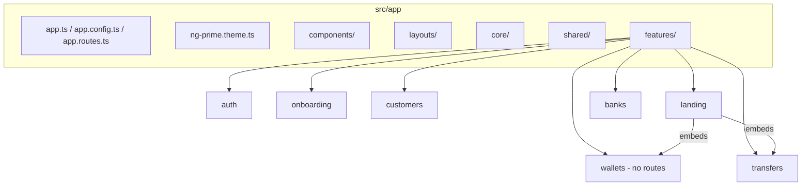
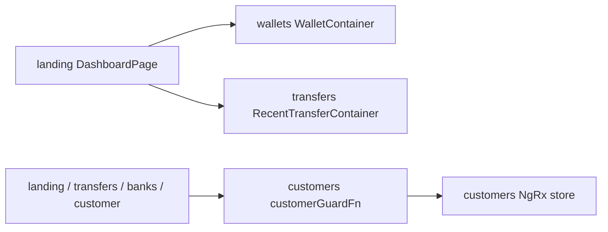

# Nexa Web — Project Structure

Reference for folder layout, routes, and cross-feature composition.

**See also:** [AI_RULES.md](./AI_RULES.md) (master conventions) · [LIBRARIES_AND_CONSTRAINTS.md](./LIBRARIES_AND_CONSTRAINTS.md) · [README.md](./README.md)

---

## Repository layout (root)

```
nexa-web/
├── angular.json              # build, assets, ComplyCube scripts, Vitest runner
├── package.json
├── tsconfig.json / tsconfig.app.json / tsconfig.spec.json
├── vitest-base.config.ts
├── .prettierrc / .editorconfig
├── .cursor/rules/nexa-web.mdc
├── public/                      # static assets (glob in angular.json)
├── docs/PROJECT_STRUCTURE.md    # this file
├── src/
│   ├── main.ts                  # bootstrapApplication(App, appConfig)
│   ├── test-setup.ts            # Vitest global mocks
│   ├── app/                     # application code
│   ├── assets/                  # i18n, css/js (complycube), images
│   ├── environments/            # environemnt.ts + duplicate asset copies
│   ├── styles/                  # global Tailwind + theme partials
│   └── testing/                 # test helpers & mocks
└── messages.xlf                 # Angular localize (separate from ngx-translate)
```

---

## `src/app/` — application tree



### App shell

| Path | Purpose |
|------|---------|
| `src/app/app.ts` | Root: `RouterOutlet`, `RoutingGlobalLoader`, `DataLoaderError` |
| `src/app/app.config.ts` | All `provide*` wiring (HTTP, Auth0, PrimeNG, translate, NgRx, features) |
| `src/app/app.routes.ts` | Only wildcard `**` → `NotFound` |
| `src/app/ng-prime.theme.ts` | Lara + emerald preset |
| `src/app/components/` | `not-found/`, `routing-global-loader/` |

### Layouts

| Path | Used by routes |
|------|----------------|
| `src/app/layouts/auth-layout/` | `/auth`, `/onboarding` |
| `src/app/layouts/public-layout/` | `/`, `/customer`, `/transfers`, `/banks` |
| `public-layout/components/public-navbar/` | Logout, nav chrome |

### Core (`src/app/core/`)

```
core/
├── constants/     countries.data.ts, states.data.ts, error.map.ts
├── interceptors/  error-handler.interceptor.ts
├── mappers/       http.mapper.ts
├── models/        entity, paging, country, state, error-model, api-problem-details
└── services/      error.service.ts, routing-loading.service.ts
                   validation-error.service.ts (commented out)
```

### Shared (`src/app/shared/`)

```
shared/
├── components/
│   ├── phone-input/          (+ models/, validators/)
│   ├── form-error/, input-error/, alert-error/, spinner/
│   └── data-loader-error/    (+ connection, not-found, server-error children)
├── validators/               cutom-validators, address-validators
└── utils/                    phone-number.utils.ts
```

---

## Features — routes, files, and responsibilities

Each routable feature exports `provideX()` from a `*.feature.ts` file registered in `app.config.ts`.

| Feature | Feature provider file | Route prefix | Layout | Guards | Page(s) |
|---------|----------------------|--------------|--------|--------|---------|
| **auth** | `features/auth/auth.feature.ts` | `/auth` | AuthLayout | none | `LoginPage` (eager) |
| **onboarding** | `features/onboarding/onboarding.feature.ts` | `/onboarding` | AuthLayout | `authGuardFn` | `OnboardingPage` (lazy) |
| **landing** | `features/landing/landing.feature.ts` | `/` | PublicLayout | auth + customer | `DashboardPage` (lazy) |
| **customers** | `features/customers/customers.feature.ts` | `/customer` | PublicLayout | auth + customer | `ProfilePage` (lazy) |
| **transfers** | `features/transfers/transfer.feature.ts` | `/transfers` | PublicLayout | auth + customer | `IndexPage` (lazy) |
| **banks** | `features/banks/banks.features.ts` | `/banks` | PublicLayout | auth + customer | `IndexPage` (eager) |
| **wallets** | *(none — no routing)* | — | — | — | Embedded in dashboard |

**Shared guard:** `features/customers/guards/customer-guard.ts` — redirects to `/onboarding` if customer not in store.

---

## Per-feature folder trees

### auth

```
features/auth/
├── auth.feature.ts / auth.routing.ts
├── pages/login-page/
└── components/login-hero/, card-login/
```

### onboarding

```
features/onboarding/
├── onboarding.feature.ts / onboarding.routing.ts
├── pages/onboarding-page/
├── components/
│   ├── onboarding-wizard/
│   ├── onboarding-email-step/
│   ├── onboarding-phone-step/
│   ├── onboarding-profile-step/
│   ├── onbaording-address-step/    # typo in folder name
│   └── onboarding-kyc-step/
├── services/   onboard-customer, comply-cube, onboarding-step-state
├── interfaces/ enums/
```

### customers (NgRx)

```
features/customers/
├── customers.feature.ts / customers.routing.ts
├── pages/profile-page/
├── components/   profile-hero, profile-info, profile-contact,
│                 profile-address, profile-document
├── guards/       customer-guard
├── services/     customer, kyc-reviews, kyc-token
├── state/        customer.actions, .reducer, .effect, .selectors
├── interfaces/   enums/
```

### landing

```
features/landing/
├── landing.feature.ts / landing.routing.ts
├── pages/dashboard-page/           # composes wallet + transfer UI
└── components/quick-actions/, quick-action-item/
```

**Dashboard composition** (`features/landing/pages/dashboard-page/dashboard-page.html`):

- `<app-wallet-container />` from **wallets** feature
- `<app-quick-actions />` from landing
- `<app-recent-transfer-container />` from **transfers** feature

### wallets (NgRx, no routes)

```
features/wallets/
├── containers/wallet-container/    # smart entry used by dashboard
├── components/
│   wallet-card, wallet-list, wallet-list-item,
│   wallet-list-item-skeleton, wallet-search, recive-funds-modal
├── services/   wallet.service, user-wallet-service.service
├── state/      wallet.actions, .reducer, .effects, .selectors
│               (two slices: wallets + wallet-card UI)
├── interfaces/
└── pipes/      wallet-number-pipe
```

### transfers

```
features/transfers/
├── transfer.feature.ts / transfer.routing.ts   # note: singular "transfer"
├── pages/index-page/
├── container/recent-transfer-container/        # singular "container"
├── components/
│   transfer-list, transfer-list-item, transfer-list-item-skeleton,
│   transfer-details, transfer-modal, bank-transfer-modal
├── services/   transfer-service.service
├── interfaces/ enums/
```

### banks

```
features/banks/
├── banks.features.ts / banks.routing.ts        # note: plural "features"
├── pages/index-page/
├── components/
│   bank-card, bank-card-skeleton, bank-select,
│   bank-select-skeleton, bank-modal
├── services/   bank, banking-token, stripe
├── interfaces/
└── pips/       bank-account-number-pipe         # typo: pips not pipes
```

---

## Cross-feature dependencies



- **Wallets** are not routable; always consumed via **landing** dashboard.
- **Transfers** recent list is also composed into the dashboard, not only on `/transfers`.
- **Customers** guard and NgRx bootstrap affect all `PublicLayout` routes except auth/onboarding.

---

## Structure rules for new work

1. New **routed** features need `{name}.feature.ts`, `{name}.routing.ts`, and registration in `app.config.ts`.
2. **Wallets** stay route-less; embed via containers in pages (currently dashboard only).
3. Put cross-cutting UI in `shared/`, cross-cutting infra in `core/`, shells in `layouts/`.
4. **NgRx `state/`** only under `customers/` and `wallets/`.
5. Match existing folder naming in each feature (`pips/`, `container/` vs `containers/`) when adding files nearby.
6. Dashboard is the integration point for wallet + recent transfers — check both landing and feature containers when changing home UX.

---

## Naming quirks (do not fix unless asked)

| Quirk | Location |
|-------|----------|
| `environemnt` | `src/environments/environemnt.ts` |
| `CUSTOMER_KEY_FEAUTRE` | customers state |
| `transfer.feature.ts` | transfers feature (singular) |
| `banks.features.ts` | banks feature (plural) |
| `pips/` | banks pipes folder |
| `onbaording-address-step/` | onboarding component folder |
| `container/` vs `containers/` | transfers vs wallets |
| `recive-funds-modal` | wallets component |
